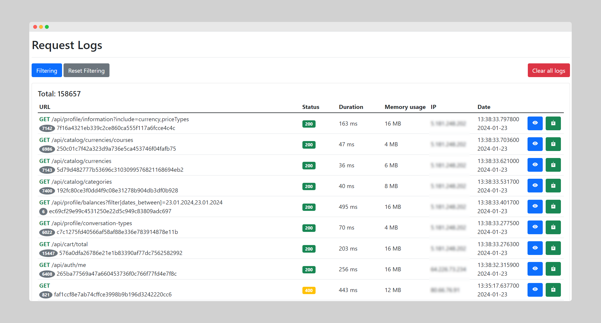

# Log request and response

This package adds a middleware which can log incoming requests and responses. You can see the logs in view panel
at `https://your.domain/request-logs`

## Laravel Installation

You can install the package via composer:

```bash
composer require dmeys/request-logger
```

You must publish the asset files with:

```bash
php artisan vendor:publish --provider="Dmeys\RequestLogger\RequestLoggerServiceProvider" 
```

You must publish the config file and assets with:

<details>
  <summary>request-logger.php</summary>

```php
return [
    'locale' => env('REQUEST_LOGGER_LOCALE', 'en'), // available 'en', 'ua'
    'middleware' => [
        \Dmeys\RequestLogger\Http\Middleware\BaseAuth::class,
    ],
    'base_auth' => [
        'login' => env('REQUEST_LOGGER_LOGIN', 'login'),
        'password' => env('REQUEST_LOGGER_PASSWORD', 'password'),
    ],
    'timezone' => env('REQUEST_LOGGER_TIMEZONE', env('APP_TIMEZONE', config('app.timezone', 'UTC'))),
    'date_format' => env('REQUEST_LOGGER_DATE_FORMAT', 'Y-m-d'),
    'time_format' => env('REQUEST_LOGGER_TIME_FORMAT', 'H:i:s.u'),
    'log_keep_days' => env('REQUEST_LOGGER_KEEP_DAYS', 14),
    'table_name' => 'request_logs',
    'enabled' => env('REQUEST_LOGGER_ENABLED', true),
    'ignore_paths' => [
        'request-logs*',
        'telescope*',
        'nova-api*',
    ],
    'hide_fields' => [
        'request' => [
            'headers' => [
                'authorization',
                'php-auth-user',
                'php-auth-pw',
            ],
            'content' => [
                'password',
                'token',
                'access_token',
            ],
        ],
        'response' => [
            'content' => [
                'password',
                'token',
                'access_token',
            ],
        ],
    ],
    'replacer_hidden_fields' => '|^_-|',
];
```

</details>

You have to execute migrations with:

```php
    php artisan migrate --path=/vendor/dmeys/request-logger/database/migrations/2021_11_05_000000_create_request_log_fingerprints_table.php
    php artisan migrate --path=/vendor/dmeys/request-logger/database/migrations/2021_11_05_000000_create_request_logs_table.php
```

This packages provides a middleware which can be added as a global middleware or as a single route.

```php
// in `app/Http/Kernel.php`

protected $middleware = [
    // ...
    
    \Dmeys\RequestLogger\Http\Middleware\RequestLogger::class
];
```

```php
// in a routes file

Route::post('/test', function () {
    //
})->middleware(\Dmeys\RequestLogger\Http\Middleware\RequestLogger::class);
```

## Supported drivers

- storage logs
- database (mysql)

## Lumen Installation

You can install the package via composer:

```bash
composer require dmeys/request-logger --dev
```

You must install [vendor:publish plugin](https://github.com/laravelista/lumen-vendor-publish)

You must register provider:

```php
//in 'bootstrap/app.php'

$app->register(\Dmeys\RequestLogger\RequestLoggerServiceProvider::class); 
```

You must publish the config file and assets with:

```bash
php artisan vendor:publish --provider="Dmeys\RequestLogger\RequestLoggerServiceProvider" 
```

This is the contents of the published config file:

<details>
  <summary>request-logger.php</summary>

```php
return [
    'locale' => env('REQUEST_LOGGER_LOCALE', 'en'), // available 'en', 'ua'
    'middleware' => [
        \Dmeys\RequestLogger\Http\Middleware\BaseAuth::class,
    ],
    'base_auth' => [
        'login' => env('REQUEST_LOGGER_LOGIN', 'login'),
        'password' => env('REQUEST_LOGGER_PASSWORD', 'password'),
    ],
    'timezone' => env('REQUEST_LOGGER_TIMEZONE', env('APP_TIMEZONE', config('app.timezone', 'UTC'))),
    'date_format' => env('REQUEST_LOGGER_DATE_FORMAT', 'Y-m-d'),
    'time_format' => env('REQUEST_LOGGER_TIME_FORMAT', 'H:i:s.u'),
    'log_keep_days' => env('REQUEST_LOGGER_KEEP_DAYS', 14),
    'table_name' => 'request_logs',
    'enabled' => env('REQUEST_LOGGER_ENABLED', true),
    'ignore_paths' => [
        'request-logs*',
        'telescope*',
        'nova-api*',
    ],
    'hide_fields' => [
        'request' => [
            'headers' => [
                'authorization',
                'php-auth-user',
                'php-auth-pw',
            ],
            'content' => [
                'password',
                'token',
                'access_token',
            ],
        ],
        'response' => [
            'content' => [
                'password',
                'token',
                'access_token',
            ],
        ],
    ],
    'replacer_hidden_fields' => '|^_-|',
];
```

</details>


You must register this config file:

```php
//in 'bootstrap/app.php'

$app->configure('request-logger');
```

You must execute migrations with:

```bash
php artisan migrate
```

You must create storage symbolic link with:

```bash
php artisan storage:link
```

You must register middleware:

```php
// in 'bootstrap/app.php'

$app->routeMiddleware([
    // ...
    
    'request-logger' => \Dmeys\RequestLogger\Http\Middleware\RequestLogger::class,
]);
```

This packages provides a middleware which can be added as a global middleware or as a single route.

```php
// in a routes file

Route::post('/test', ['uses' => 'TestController@test', 'middleware' => ['request-logger']]);
```

### Data Pruning

Without pruning, the `request_logs` table can accumulate records very quickly.
To mitigate this, you should schedule the `request-logs:clear` artisan command to run daily:

```php
$schedule->command('request-logs:clear')->daily();
```

Running the `php artisan request-logs:clear` command deletes
recorded logs older than the number of days specified in the `log_keep_days` configuration.

To delete all logs, add the "--all" parameter `php artisan request-logs:clear --all`

### Configuration custom fields

The Request Logger allows you to add custom fields for logging.
The package provides the `configureRequestLoggerCustomFields` function, which must return an array containing the custom
fields.
Additionally, make sure to add these custom fields to the database table `request_logs`.

Here's an example of using `configureRequestLoggerCustomFields()`:

- Add the middleware `ConfigureRequestLoggerMiddleware`.
- In the middleware, implement the `handle` method and specify custom fields using
  the `configureRequestLoggerCustomFields` function.

```php
final class ConfigureRequestLoggerMiddleware
{
	public function handle(Request $request, Closure $next)
	{
		configureRequestLoggerCustomFields(function () use ($request) {
			return ['user_id' => $request->user()->id ?? null];
		});

		return $next($request);
	}
}
```

- Register the middleware in the Http Kernel.

These steps outline how to use the `configureRequestLoggerCustomFields` function to add custom fields to your logging
setup.

### Testing

``` bash
php vendor/bin/phpunit
```
